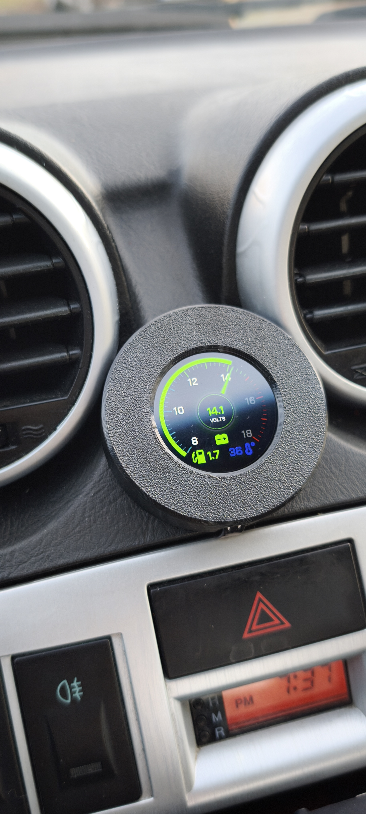
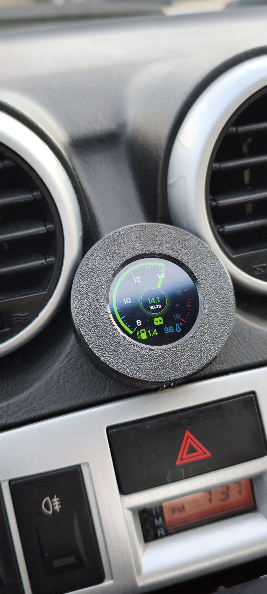
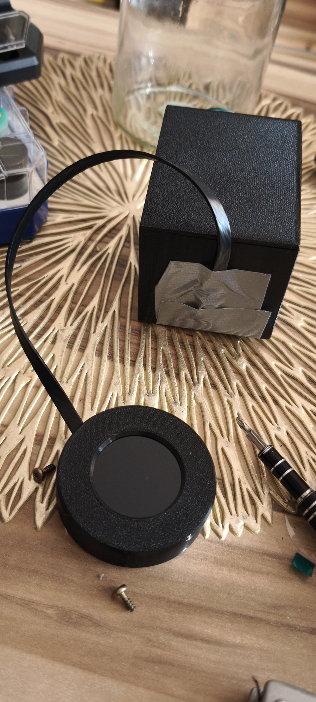
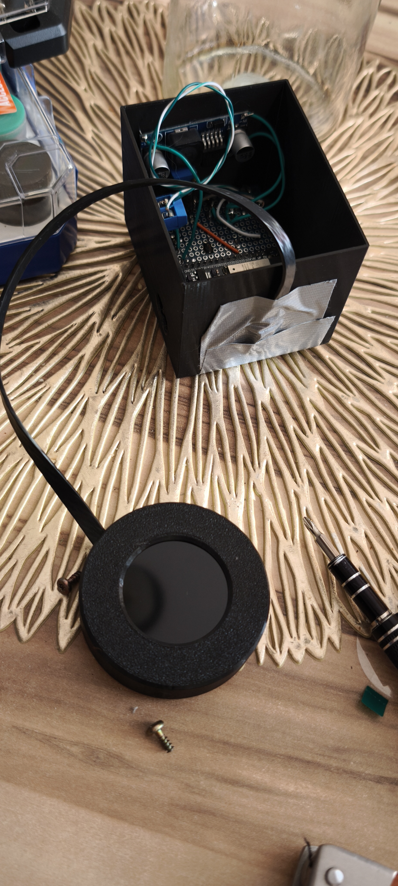
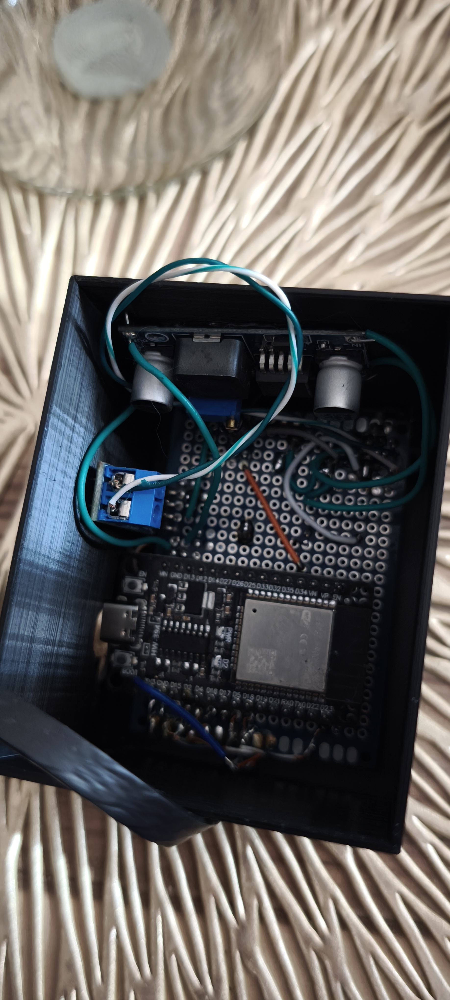

# Mini Gauge - Hyundai Coupe / Tiburon (GK FL 2002-2008)

> Custom digital replacement for the factory multi-gauge, designed for dashboards modified with a 2DIN head unit.

<p align="center">
  
  
</p>

## Why this project exists

The **Hyundai Coupe / Tiburon (GK FL)** comes with a factory multi-gauge cluster (torque, fuel, volts) mounted in the center console. When upgrading the stock head unit to a **2DIN multimedia radio**, the multi-gauge physically cannot fit back into the dashboard — there is simply no room for it.

This project solves that problem. **Mini Gauge** is a compact, custom-built digital gauge that replaces the original multi-gauge and fits into the remaining space. It provides the same (and more) information as the factory unit:

- **Voltmeter** — battery/charging system voltage
- **Coolant temperature** — read directly from the ECU via CAN bus
- **Average fuel consumption** — calculated in real-time (L/100km while driving, L/h at idle)

Everything runs on an **ESP32** microcontroller with a round **1.28" IPS display (GC9A01)**, communicating with the car's ECU via a **CAN bus sniffer** based on the Siemens SIMK43/SIMK4x protocol documentation.

## How it works

### CAN Bus Sniffer

The ESP32 passively listens to the vehicle's CAN bus using an **SN65HVD230** transceiver module. It decodes specific CAN message IDs from the Siemens SIMK43 ECU to extract:

- **Coolant temperature** (CAN ID `0x329`)
- **Vehicle speed & RPM** (used for fuel consumption calculation)
- **ECU battery voltage** (CAN ID `0x545`)

The CAN protocol decoding is based on documentation available in the [Documentation/](Documentation/) folder.

### Hybrid Voltmeter (Sensor Fusion)

The voltmeter uses a weighted average of two sources:

- **70%** — hardware ADC reading via a resistor voltage divider (100k / 20k) on GPIO 34, providing fast, real-time response
- **30%** — ECU voltage report read from CAN bus (ID `0x545`), providing stable, calibrated reference

This fusion approach gives both responsiveness and accuracy. In future production iterations, the analog part can be removed entirely — all data can be read exclusively from the CAN bus.

### Fuel Consumption Algorithm

- **While driving** (speed > 0): displays average consumption in **L/100km** using a "Time Window Accumulation" algorithm for stable readings
- **At idle** (speed = 0): switches to **L/h** (liters per hour)

### Ignition-Controlled Power

The device powers on only when the ignition is turned on (IGN +12V from the factory connector). This prevents battery drain when the engine is off.

### Auto Night Mode (Dimmer)

The gauge detects the car's illumination signal (ILL +12V) via GPIO 13. When headlights are on:

- Display brightness is automatically reduced
- UI color palette changes to a darker theme

This prevents glare and distraction during night driving.

### Display & UI

The round **1.28" GC9A01 IPS** display runs the **LVGL** graphics library at **60 FPS** via an overclocked SPI bus (80 MHz). The UI was designed using **SquareLine Studio**.

## Prototype Photos

<p align="center">
  
  
</p>

<p align="center">
  
</p>

## Hardware (BOM)

| Component | Description | Link |
| --- | --- | --- |
| **ESP32 NodeMCU-32s** | Microcontroller (do not use ESP8266) | — |
| **1.28" GC9A01 Round LCD** | 240x240 IPS, SPI, 2.8-3.3V | [AliExpress](https://pl.aliexpress.com/item/1005007702290129.html) |
| **SN65HVD230 VP230** | CAN bus transceiver module, 3.3V | [AliExpress](https://pl.aliexpress.com/item/1005008709090889.html) |
| **LM2596S Buck Converter** | DC-DC step-down 12V to 5V | [AliExpress](https://pl.aliexpress.com/item/1005007286236519.html) |
| **Universal PCB** | Double-sided prototype board (5x7cm) | [AliExpress](https://pl.aliexpress.com/item/1005007857095443.html) |
| **Resistors** | 100k and 20k (voltage divider), 20k (ILL protection) | — |
| **Zener diode** | 3.3V — GPIO protection for ILL input | — |
| **Electrolytic capacitors** | 100uF/25V, 100uF/10V (buck converter filtering), 1uF (ADC smoothing) | — |
| **Wires** | Hookup / jumper wires | — |


## Wiring

Full schematic is available in [Documentation/schematv2.pdf](Documentation/schematv2.pdf).

The device connects to the factory **M15-B connector** (multi-gauge plug).

### Power Supply

| Source (car) | Destination |
| --- | --- |
| Pin 3 (IGN +12V) | Buck converter IN+ |
| Pin 12 (GND) | Buck converter IN- |
| Buck converter OUT+ (5V) | ESP32 VIN |
| Buck converter OUT- | ESP32 GND |

> All grounds (car, ESP32, CAN module) must be connected together.

### CAN Bus (SN65HVD230)

| Car connector | Module | ESP32 |
| --- | --- | --- |
| Pin 7 (CAN H) | H | — |
| Pin 1 (CAN L) | L | — |
| — | CTX | GPIO 17 |
| — | CRX | GPIO 16 |
| — | 3V3 | 3V3 |
| — | GND | GND |

### Sensors & Inputs

| Function | Car pin | Circuit | ESP32 |
| --- | --- | --- | --- |
| Voltmeter | Pin 6 (BAT +12V) | 100k / 20k divider + 1uF cap | GPIO 34 |
| Night mode | Pin 9 (ILL +12V) | 20k resistor + 3.3V Zener | GPIO 13 |

### Display (GC9A01)

| Display | ESP32 |
| --- | --- |
| SDA (MOSI) | GPIO 23 |
| SCL (SCK) | GPIO 18 |
| CS | GPIO 5 |
| DC | GPIO 2 |
| RES | GPIO 4 |
| VCC | 3V3 |
| GND | GND |

## Building & Flashing

The project uses **PlatformIO** in VS Code.

```bash
git clone https://github.com/your-username/Mini_gauge_Hyundai_coupe.git
```

1. Open the project folder in VS Code with PlatformIO installed
2. Check `platformio.ini` — adjust `upload_port` if needed (e.g. `COM10` or `/dev/ttyUSB0`)
3. Click **PlatformIO: Upload**

### Configuration

In `src/main.cpp`:

- `#define DEBUG_CAN_SNIFFER true/false` — enable raw CAN frame output on Serial Monitor (115200 baud)
- `#define VOLT_CALIBRATION 6.532f` — calibrate voltage divider ratio against a multimeter

## Calibration

### Coolant Temperature

If the reading differs from an OBD2 scanner, adjust the offset in `src/main.cpp` in the `case 0x329:` block inside `processCAN()`:

```cpp
(HEX * 0.75) - 48.0  // change -48.0 to shift the reading
```

### Voltage

If consistently off, adjust the `VOLT_CALIBRATION` define in `main.cpp`.

## 3D Printed Enclosure

STL files for the housing are in the [stl/](stl/) directory.

- **Recommended material:** PETG, ASA, or ABS (do not use PLA — it will deform in a hot car interior)
- **Layer height:** 0.16-0.2mm
- **Infill:** 20-40%

## Production Version Notes

This is a working prototype built on a universal PCB with through-hole components and jumper wires. For a production version:

- Design a **custom PCB** with proper traces, eliminating the need for manual wiring
- Design a **dedicated injection-molded or CNC-machined enclosure** instead of a 3D-printed one
- **Remove the analog voltage divider** circuit — read all data exclusively from the CAN bus (the 70/30 sensor fusion was a prototype compromise)
- Solder all components directly onto the finished PCB module

## Future Ideas

- **OBD / K-Line diagnostics** — add an external OBD module (e.g. ELM327 compatible) connected to the ESP32 via K-Line to read and clear DTC fault codes directly from the ECU, turning the gauge into a basic diagnostic tool
- **SD card logging** — add a micro SD card module to record telemetry data. When a **Check Engine** light (MIL) is detected on the CAN bus, automatically start capturing detailed logs (CAN frames, sensor readings, timestamps) for 10-20 minutes, providing a "black box" snapshot of what happened and why the fault was triggered
- **Extended CAN data** — decode additional CAN IDs to display more parameters (e.g. intake air temperature, throttle position, boost pressure on turbo models)
- **Wi-Fi / Bluetooth data export** — use the ESP32's built-in wireless capabilities to push logged data to a phone app or a simple web dashboard for review after driving
- **Multi-screen UI** — add swipeable or button-toggled screens to show different data views (e.g. a dedicated diagnostics screen, a trip computer screen, a performance screen with 0-100 km/h timer)

## Repository Structure

```
├── Documentation/      # CAN protocol docs, schematics (schematv2.pdf)
├── gauge_assets/       # UI design assets (icons, backgrounds, needles)
├── img/                # Project photos
├── src/                # Source code
│   ├── main.cpp        # Main logic, CAN sniffer, sensor fusion
│   ├── logic.cpp/.h    # Gauge behavior, colors, calculations
│   ├── ui.c/.h         # LVGL UI code (SquareLine Studio generated)
│   ├── components/     # UI components
│   ├── screens/        # UI screens
│   ├── fonts/          # Custom fonts
│   └── images/         # UI bitmaps
├── stl/                # 3D printable enclosure files
├── lib/                # Local libraries
├── platformio.ini      # Build configuration
└── README.md
```

## License

This project is open-source. Feel free to modify and adapt it for your own vehicle.

- **UI Design:** SquareLine Studio
- **CAN Decoding:** Based on [Siemens SIMK43 ECU documentation (OpenGK)](https://opengk.org/index.php?title=CAN_Bus_messages)
